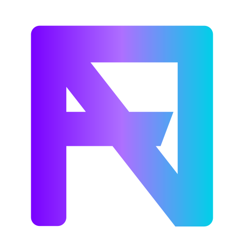
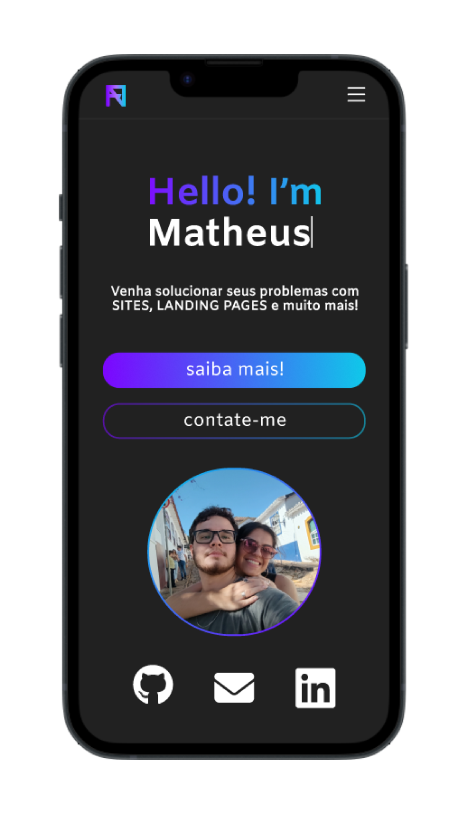
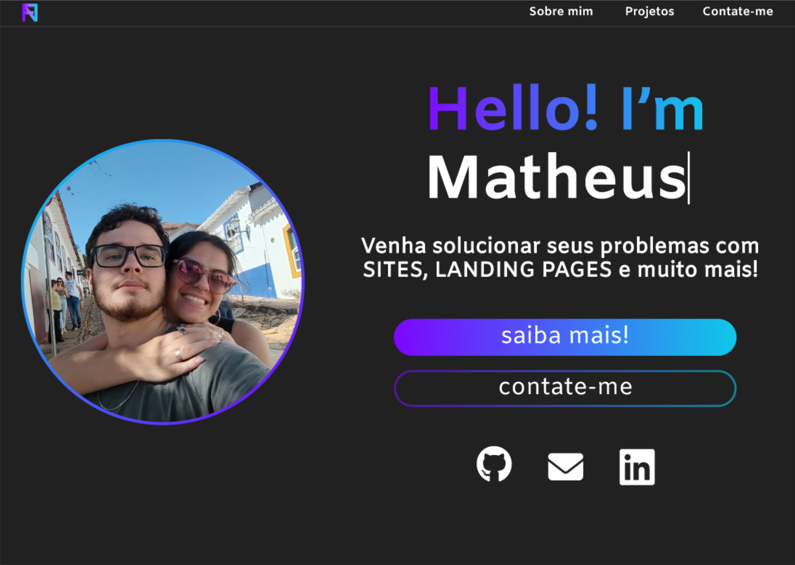

  

<h1 align="center">👨‍💻 Portifolio</h1>
<h2 align="center">Portifolio para expor projetos e habilidades</h2>

<h4 align="center"> 
	🚧  Portifolio 🚀 Em construção...  🚧
</h4>

Tabela de conteúdos
=================
<!--ts-->
   * [Sobre o projeto](#-sobre-o-projeto)
   * [Funcionalidades](#-funcionalidades)
   * [Layout](#-layout)
     * [Mobile](#mobile)
     * [Web](#web)
   * [Tecnologias](#-tecnologias)
   * [Autor](#-autor)
   * [Licença](#user-content--licença)
<!--te-->

## 💻 Sobre o projeto

👨‍💻 Portifolio - é uma forma de divulgar e expor o serviço e as habilidade que possui em quanto desenvolvedor ou qualquer outra profissão.

---

## ⚙️ Funcionalidades

- [x] Breve descrição (sobre mim)

- [x] Os usuários tem acesso aos projetos:
  - [x] vizualizar o projeto finalizado
  - [x] vizualizar partes do código do projeto
     
- [x] Os usuários tem acesso aos contatos:
  - [x] forma de entrar em contato por e-mail
  - [x] forma de entrar em contato por whatsapp

---

## 🎨 Layout

O layout da aplicação está disponível no Figma:

**[Acessar Figma](https://www.figma.com/file/FF7Sa8JZZFZwZkCvsklmXH/Portifolio)**

### Mobile

  

### Web

  

---

## 🛠 Tecnologias

As seguintes ferramentas foram usadas na construção do projeto:

#### **Website**  ([Next.js](https://nextjs.org/)  +  [TypeScript](https://www.typescriptlang.org/))

#### **Utilitários**

-   Protótipo:  **[Figma](https://www.figma.com/)**  →  **[Protótipo (Portifolio)](https://www.figma.com/file/FF7Sa8JZZFZwZkCvsklmXH/Portifolio)**
-   Editor:  **[Visual Studio Code](https://code.visualstudio.com/)**
-   Ícones:  **[Font Awesome](https://fontawesome.com/)**
-   Fontes:  **[Amiko](https://fonts.google.com/specimen/Amiko)**,

---

## 🙋‍♂️ Autor

<a href="https://github.com/fnmatheus">
 
  
 
Matheus Nascimento

  
</a>

 

---

## 📝 Licença

Este projeto esta sobe a licença [MIT](./LICENSE).

Feito por Matheus Nascimento 👋🏽 [Entre em contato!](https://www.linkedin.com/in/fnmatheus/)

---
